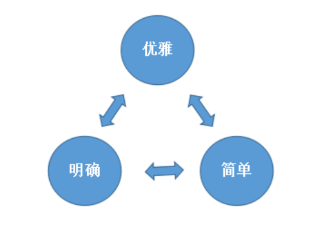
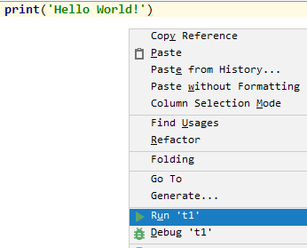
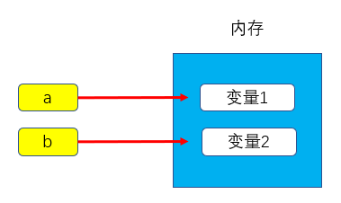
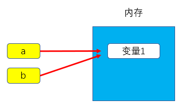

# Python基础

Life is short, I need python（人生苦短，我用python！）

## Python起源

Python的作者是著名的"**龟叔**"Guido van Rossum(吉多.范罗苏姆)，1989年，龟叔为了打发无聊的圣诞节，决心开发一个新的**解释程序**，作为ABC语言的一种继承。于是便开始编写Python语言。


**ABC**是由吉多参加设计的一种教学语言，就吉多本人看来，ABC这种语言非常优美和强大，是**专门为非专业程序员设计的**。但是ABC语言并没有成功。**Guido**本人看来，**ABC**失败的原因是高级语言为时过早，并且平台迁移能力弱，难以添加新功能，仅仅专注于编程初学者，没有把有经验的编程人员纳入其中，在**Python**中解决了这些问题，让拓展模块的编写非常容易，并且可以在多平台进行运行....

Python的意思是蟒蛇，是取自英国20世纪70年代首播的电视喜剧《蒙提.派森干的飞行马戏团》(Monty Python’s Flying Circus)，Guido非常喜欢这个剧，所以选择Python作为新语言的名字。

**1991年**，第一个Python编译器诞生。它是用C语言实现的，并能够调用C语言的库文件。

## 解释型和编译型语言

解释型语言是指在运行时由解释器逐行读取和执行源代码的语言。在这种语言中，代码不需要被提前编译成机器代码，而是直接由解释器逐行解析并执行。这使得开发过程更加灵活，程序员可以快速测试和修改代码。Python、JavaScript 和 Ruby 等都是常见的解释型语言。尽管解释型语言在开发时提供了便利，但由于逐行解释执行，通常在性能上不如编译型语言。

编译型语言则是指在执行之前，源代码需要通过编译器转换成机器代码或中间代码。这个过程通常会产生一个独立的可执行文件，运行时不再需要源代码或编译器。这种做法通常能提高程序的执行效率，因为编译后的代码可以直接在机器上运行。C、C++ 和 Go 等语言都是编译型语言。虽然编译型语言在执行速度上表现出色，但编译过程通常较长，调试和修改代码时也不如解释型语言方便

## 编程语言排行

- [TIOBE Index](https://www.tiobe.com/tiobe-index/)
- [PYPL Index](https://pypl.github.io/PYPL.html)

## Python应用领域

**人工智能**

Python 是人工智能和机器学习领域的首选语言，主要得益于其简洁的语法和丰富的科学计算库。以下是几种典型的 Python 库：

- **NumPy**：支持大量的维度数组与矩阵运算，此外也针对数组运算提供了大量的数学函数库。
- **SciPy**：基于 NumPy 的科学计算库，提供了许多算法和函数，适用于数值积分与优化、线性代数、统计等科学计算任务。
- **Matplotlib**：强大的绘图库，可以生成各种图形，包括线图、散点图、柱状图等，常用于数据可视化。
- **TensorFlow**：由 Google 开发的开源深度学习框架，广泛用于构建和训练神经网络。

**云计算**

Python 是云计算领域最火的语言之一，广泛用于构建和管理云基础设施。Python 的简洁性和可读性使得它成为开发云服务、自动化任务、数据处理脚本的理想选择。

**WEB开发**

Python 拥有众多优秀的 Web 框架，适合快速开发高效、安全的 Web 应用程序。许多大型网站和服务都是用 Python 开发的，例如 YouTube、Dropbox、豆瓣等。以下是几种典型的 Web 框架：

- **Django**：一个高层次的 Python Web 框架，鼓励快速开发和简洁、实用的设计，是全栈框架的代表。
- **Flask**：一个轻量级的 Web 框架，强调简单性和灵活性，适合构建小型项目或微服务。

**系统运维**

Python 是系统运维人员的必备语言。它可以用于编写脚本来自动化任务、管理服务器、处理文件和文本、与操作系统进行交互等。Python 的跨平台性使得它在不同的操作系统上都能有效发挥作用。

**金融**

Python 在金融领域特别是量化交易和金融分析方面得到广泛应用。Python 的灵活性和丰富的金融数据分析库，使得它在金融工程领域的使用日益增多，重要性逐年提高。

**图形界面开发 (GUI)**

Python 也可以用于开发桌面应用程序，以下是几种常用的图形界面开发库：

- **PyQt**：基于 Qt 框架的 Python 绑定，适合开发复杂的桌面应用程序。
- **WxPython**：基于 wxWidgets 的 Python GUI 库，提供了跨平台的原生控件。
- **TkInter**：Python 的标准 GUI 库，适合初学者和轻量级应用的快速开发。

## Python实际应用

**谷歌**：Google App Engine、code.google.com、Google Earth、谷歌爬虫、Google 广告等项目都在大量使用 Python 开发。

**CIA**：美国中情局网站就是用 Python 开发的。

**NASA**：美国航天局（NASA）大量使用 Python 进行数据分析和运算。

**YouTube**：世界上最大的视频网站 YouTube 就是用 Python 开发的。

**Dropbox**：美国最大的在线云存储网站，全部用 Python 实现，每天网站处理 10 亿个文件的上传和下载。

**Instagram**：美国最大的图片分享社交网站，每天超过 3000 万张照片被分享，全部用 Python 开发的。

**Facebook**：大量的基础库均通过 Python 实现的。

**Redhat**：世界上最流行的 Linux 发行版本中的 yum 包管理工具就是用 Python 开发的。

**豆瓣**：公司几乎所有的业务均是通过 Python 开发的。

**知乎**：国内最大的问答社区，通过 Python 开发（国外 Quora）。

除上面之外，还有搜狐、金山、腾讯、盛大、网易、百度、阿里、淘宝、土豆、新浪、果壳等公司都在使用 Python 完成各种各样的任务

## Python设计哲学



Python 的设计哲学与其他编程语言相比，有几个显著的不同之处：

1. 可读性优先：
   - Python 强调代码的可读性，力求清晰明了。这与如 C++ 或 Java 等语言相比，后者往往更关注性能或复杂的语法结构。
2. 简洁性：
   - Python 鼓励用较少的代码实现功能，通常会有简化的语法，而像 Java 这样的语言则要求更多的样板代码。
3. 动态类型：
   - Python 是动态类型语言，变量类型在运行时决定，这与静态类型语言（如 C# 和 Java）形成鲜明对比，后者在编译时必须声明变量类型。
4. 多范式支持：
   - Python 支持多种编程范式（如面向对象、函数式编程），而一些语言则更倾向于某一特定范式，如 Java 主要是面向对象的。
5. 强大的标准库：
   - Python 附带了一个丰富的标准库，提供了大量现成的模块和功能，而其他语言可能需要依赖外部库或框架。
6. 社区和文化：
   - Python 拥有一个积极的社区，强调开放和共享，鼓励用户贡献代码和文档，而其他语言的社区文化可能更加保守或封闭。

## 安装python

略

## 运行python代码

在硬盘创建文件 t1.py，并且使用 PyCharm 打开，输入以下代码

```python
print('Hello World!')
```

然后右键运行



运行结果

```
C:\Users\Aaron\AppData\Local\Programs\Python\Python35\python.exe C:/Users/Aaron/Desktop/py/t1.py
Hello World!

Process finished with exit code 0
```

## 注释

当行注释：# 被注释内容

多行注释：''' 被注释内容 '''，或者 """ 被注释内容 """

## 变量

变量是什么？  变量：把程序运行的中间结果临时的存在内存里，以便后续的代码调用。

## 声明变量

```python
a = "Hello World!"
print(a)
```

## 变量定义的规则

- 变量名只能是 字母、数字或下划线的任意组合
- 变量名的第一个字符不能是数字
- 以下关键字不能声明为变量名
- ['and', 'as', 'assert', 'break', 'class', 'continue', 'def', 'del', 'elif', 'else', 'except', 'exec', 'finally', 'for', 'from', 'global', 'if', 'import', 'in', 'is', 'lambda', 'not', 'or', 'pass', 'print', 'raise', 'return', 'try', 'while', 'with', 'yield']
- 变量的定义要具有可描述性。

## 变量的赋值

```python
a = "变量1"
b = "变量2"
```





```python
a = "变量1"
b = a
```





## 常量

常量即指不变的量，如 pi 3.141592653..., 或在程序运行过程中不会改变的量。

## 程序交互

```python
name = input("请输入姓名：")
print(name)
```

执行脚本就会发现，程序会等待你输入姓名后再往下继续走。

```python
请输入姓名：Aaron
Aaron
```

## 基础数据类型

### 整数型（int）

在 32 位机器上，整数的位数为 32 位，取值范围为 -2**31～2**31-1，即 -2147483648～2147483647

在 64 位系统上，整数的位数为 64 位，取值范围为 -2**63～2**63-1，即 -9223372036854775808～9223372036854775807

注意：在 Python3 里不再有 long 类型了，全都是 int

```python
a = 2**64
print(type(a))    #type()是查看数据类型的方法

b = 2**60
print(type(b))
```

运行结果

```python
<class 'int'>
<class 'int'>
```

## 字符串类型（str）

在 Python 中, 加了引号的字符都被认为是字符串！

```python
a = "大家好"
b = '''
欢迎大家!
今天我们学习python!'''

print(a,b)
```

运行结果

```python
大家好
欢迎大家!
今天我们学习python!
```

字符串拼接

```python
a = 'hello '
b = 'welcome '
print(b + a,'*' * 3,a * 3)
```

运行结果

```python
welcome hello  *** hello hello hello
```

## 布尔值（True, False)

布尔类型很简单，就两个值 ，一个 True(真)，一个 False(假), 主要用记逻辑判断

```python
a = 3
b = 5
print(a < b, a > b , a != b)
```

运行结果

```
True False True
```

## 格式化输出

```python
name = input("姓名：")
age = input("年龄：")
job = input("工作：")
info = '''
----------- info of %s -----------
姓名：%s
年龄：%s
工作：%s
''' % (name,name,age,job)
print(info)
```

运行结果

```
姓名：Aaron
年龄：18
工作：Teacher
----------- info of Aaron -----------
姓名：Aaron
年龄：18
工作：Teacher
```

## 基本运算符

算数运算

| 运算符 | 描述           | 实例              |
| ------ | -------------- | ----------------- |
| +      | 加             | a+b 输出结果30    |
| -      | 减             | a-b  输出结果-10  |
| *      | 乘             | a*b  输出结果200  |
| /      | 除             | b/a  输出结果2    |
| %      | 取模  得到余数 | b%a  输出结果0    |
| **     | 幂             | a**2  输出结果100 |
| //     | 取整           | 9//2  输出结果4   |

比较运算

| 运算符 | 描述     | 实例              |
| ------ | -------- | ----------------- |
| ==     | 等于     | a == b  返回False |
| !=     | 不等于   | a != b  返回True  |
| <>     | 不等于   | a <> b  返回True  |
| >      | 大于     | a > b  返回False  |
| <      | 小于     | a < b  返回True   |
| >=     | 大于等于 | a >= b  返回False |
| <=     | 小于等于 | a <= b  返回True  |

赋值运算

| 运算符 | 描述             | 实例      |
| ------ | ---------------- | --------- |
| =      | 赋值运算符       | c = a + b |
| +=     | 加法赋值运算符   | c += a    |
| -=     | 加法赋值运算符   | c -= a    |
| *=     | 乘法赋值运算符   | c *= a    |
| /=     | 除法赋值运算符   | c /= a    |
| %=     | 取模赋值运算符   | c %= a    |
| **=    | 幂赋值运算符     | c **= a   |
| //=    | 取整除赋值运算符 | c //= a   |

逻辑运算

| 运算符 | 描述 | 实例         |
| ------ | ---- | ------------ |
| and    | 与   | a and b      |
| or     | 或   | a or b       |
| not    | 非   | not(a and b) |

在没有 () 的情况下 not 优先级高于  and，and 优先级高于 or，即优先级关系为()>not>and>or，同一优先级从左往右计算。

x or y , x 为真，值就是 x，x 为假，值是 y； x and y, x 为真，值是 y,x 为假，值是 x。

成员运算

| 运算符 | 描述                                              | 实例       |
| ------ | ------------------------------------------------- | ---------- |
| in     | 如果在指定的序列中找到值返回True,否则返回False    | x in y     |
| not in | 如果在指定的序列中没有找到返回True，否则返回False | x not in y |

```python
print('a' in 'abcd')
print('y' not in 'xyzasd')
```

运行结果

```
True
False
```

**Python 运算符优先级**

以下表格列出了从最高到最低优先级的所有运算符：

| 运算符                   | 描述                                                   |
| ------------------------ | ------------------------------------------------------ |
| **                       | 指数 (最高优先级)                                      |
| ~ + -                    | 按位翻转, 一元加号和减号 (最后两个的方法名为 +@ 和 -@) |
| * / % //                 | 乘，除，取模和取整除                                   |
| + -                      | 加法减法                                               |
| >> <<                    | 右移，左移运算符                                       |
| &                        | 位 'AND'                                               |
| ^                        | 位运算符                                               |
| <= < > >=                | 比较运算符                                             |
| <> == !=                 | 等于运算符                                             |
| = %= /= //= -= += *= **= | 赋值运算符                                             |
| is is not                | 身份运算符                                             |
| in not in                | 成员运算符                                             |
| not and or               | 逻辑运算符                                             |

## 流程控制之 --if

单分支

```python
if 条件:
    满足条件后要执行的代码
```

双分支

```python
"""
if 条件:
    满足条件执行代码
else:
    if条件不满足就走这段
"""
age = 48

if age > 50 :
    print("尚能饭否")
else:
    print("廉颇老矣")
```

运行结果

```
廉颇老矣
```

if...else ... 可以有多个分支条件

```python
if 条件:
    满足条件执行代码
elif 条件:
    上面的条件不满足就走这个
elif 条件:
    上面的条件不满足就走这个
elif 条件:
    上面的条件不满足就走这个    
else:
    上面所有的条件不满足就走这段
```

## 流程控制之 --while

基本循环

```python
while 条件:
     循环体
```

如果条件为真，那么循环体则执行

如果条件为假，那么循环体不执行

循环中止语句

break 用于完全结束一个循环，跳出循环体执行循环后面的语句

continue 和 break 有点类似，区别在于 continue 只是终止本次循环，接着还执行后面的循环，break 则完全终止循环

```python
print('猜数字游戏开始')
num = 54
while True:
    guess = int(input("您猜数字是什么？(输入0-100的数字)"))
    if guess < num:
        print("您猜小了")
        continue
    elif guess > num:
        print("您猜大了")
        continue
    break

print("您猜对了！")
```

运行结果

```
猜数字游戏开始
您猜数字是什么？(输入0-100的数字)50
您猜小了
您猜数字是什么？(输入0-100的数字)60
您猜大了
您猜数字是什么？(输入0-100的数字)54
您猜对了！
```

while ... else ..

while 后面的 else 作用是指，当 while 循环正常执行完，中间没有被 break 中止的话，就会执行 else 后面的语句

## 基础数据类型

### 数字 (int)

```python
v = 11
data = v.bit_length()   #当十进制用二进制表示时，最少使用的位数
print(data)
```

运行结果

```
4
```

### 布尔值 ()bool

布尔值就两种：True，False。就是反应条件的正确与否。

真  1  True。

假  0  False。

### 字符串 str

#### 字符串的索引与切片

```python
a = 'ABCDEFGHIJK'
print(a[0])
print(a[3])
print(a[5])
print(a[7])

a = 'ABCDEFGHIJK'
print(a[0:3])
print(a[2:5])
print(a[0:]) #默认到最后
print(a[0:-1]) # -1 是列表中最后一个元素的索引，但是要满足顾头不顾腚的原则，所以取不到K元素
print(a[0:5:2]) #加步长
print(a[5:0:-2]) #反向加步长
```

运行结果

```
A
D
F
H
ABC
CDE
ABCDEFGHIJK
ABCDEFGHIJ
ACE
FDB
```

#### 字符串常用方法

```python
words = "beautiful is better than ugly."
print(words.capitalize())   #首字母大写
print(words.swapcase())     #大小写翻转
print(words.title())        #每个单词的首字母大写


## 内容居中，总长度，空白处填充
a = "test"
ret = a.center(20,"*")
print(ret)


## 数字符串中的元素出现的个数
ret = words.count("e",0,30)
print(ret)
a = "aisdjioadoiqwd12313assdj"


## startswith 判断是否以...开头
## endswith 判断是否以...结尾
print(a.startswith("a"))
print(a.endswith("j"))
print(a.startswith('sdj',2,5))
print(a.endswith('ado',7,10))


## 寻找字符串中的元素是否存在
print(a.find('sdj',1,10))   # 返回的找到的元素的索引，如果找不到返回-1
print(a.index('sdj',1,10))  # 返回的找到的元素的索引，找不到报错。


## split 以什么分割，最终形成一个列表此列表不含有这个分割的元素。
ret = words.split(' ')
print(ret)
ret = words.rsplit(' ',2)
print(ret)


## format的三种玩法 格式化输出
print('{} {} {}'.format('aaron',18,'teacher'))
print('{1} {0} {1}'.format('aaron',18,'teacher'))
print('{name} {age} {job}'.format(job='teacher',name='aaron',age=18))


## strip
a = '****asdasdasd********'
print(a.strip('*'))
print(a.lstrip('*'))
print(a.rstrip('*'))


## replace
print(words.replace('e','a',2))
print(words.isalnum()) #字符串由字母或数字组成
print(words.isalpha()) #字符串只由字母组成
print(words.isdigit()) #字符串只由数字组成
```

### 元祖 tuple

元组被称为只读列表，即数据可以被查询，但不能被修改。

### 列表 list

列表相比于字符串，不仅可以储存不同的数据类型，而且可以储存大量数据，32 位 python 的限制是 536870912 个元素,64 位 python 的限制是 1152921504606846975 个元素。而且列表是有序的，有索引值，可切片，方便取值。

#### 增

```python
li = [1,'a',2,'d',4]
li.insert(0,22)     # 按照索引去增加
print(li)
li.append('ddd')    # 增加到最后
print(li)
li.extend(['q,a,w'])    # 迭代的去增
print(li)
li.extend(['q,a,w','das'])    # 迭代的去增
print(li)
```

运行结果

```
[22, 1, 'a', 2, 'd', 4]
[22, 1, 'a', 2, 'd', 4, 'ddd']
[22, 1, 'a', 2, 'd', 4, 'ddd', 'q,a,w']
[22, 1, 'a', 2, 'd', 4, 'ddd', 'q,a,w', 'q,a,w', 'das']
```

#### 删

```python
li = [1,'a',2,'d',4,5,'f']
a = li.pop(1)  # 按照位置去删除，有返回值
print(a)
del li[1:3]     # 按照位置去删除，也可切片删除没有返回值。
print(li)
li.remove('f')
print(li)
li.clear()
print(li)
```

运行结果

```
a
[1, 4, 5, 'f']
[1, 4, 5]
[]
```

#### 改

```python
li = [1,'a',2,'d',4,5,'f']
li[1] = 'aaa'
print(li)
li[2:3] = [3,'e']
print (li)
```

运行结果

```
[1, 'aaa', 2, 'd', 4, 5, 'f']
[1, 'aaa', 3, 'e', 'd', 4, 5, 'f']
```

#### 查

切片去查，或者循环去查。

#### 其他操作

```python
li = [1,2,4,5,4,2,4]
print (li.count(4))     # 统计某个元素在列表中出现的次数
print (li.index(2))     # 用于从列表中找出某个值第一个匹配项的索引位置
li.sort()               # 用于在原位置对列表进行排序
print (li)
li.reverse()            # 将列表中的元素反向存放
print (li)
```

运行结果

```
3
1
[1, 2, 2, 4, 4, 4, 5]
[5, 4, 4, 4, 2, 2, 1]
```

### 字典dict

字典是python中唯一的映射类型，采用键值对（key-value）的形式存储数据。python对key进行哈希函数运算，根据计算的结果决定value的存储地址，所以字典是无序存储的，且key必须是可哈希的。可哈希表示key必须是不可变类型，如：数字、字符串、元组。

#### 增

```python
dic = {"age":18, "name":"aaron"}

dic['li'] = ["a","b","c"]
print(dic)

dic.setdefault('k','v')
## 在字典中添加键值对，如果只有键那对应的值是none,但是如果原字典中存在设置的键值对，则他不会更改或者覆盖。
print(dic)

dic.setdefault('k','v1')
print(dic)
```

#### 删

```python
dic = {"age":18, "name":"aaron"}

dic_pop = dic.pop('age')
## pop根据key删除键值对，并返回对应的值，如果没有key则返回默认返回值
print(dic_pop)

dic_pop = dic.pop('sex','查无此项')
print(dic_pop)

dic['age'] = 18
print(dic)

del dic['name']
print(dic)

dic['name'] = 'demo'
dic_pop = dic.popitem()
## 随机删除字典中的某个键值对，将删除的键值对以元祖的形式返回
print(dic_pop)

dic_clear = dic.clear()
## 清空字典
print(dic,dic_clear)
```

#### 改

```python
dic = {"age":18, "name":"aaron", 'sex':'male'}
dic2 = {"age":30, "name":'demo'}

dic2.update(dic)
## 将dic所有的键值对覆盖添加（相同的覆盖，没有的添加）到dic2中
print(dic2)

dic2['age'] = 30
print(dic2)
```

#### 查

```python
dic = {"age":18, "name":"aaron", 'sex':'male'}

value = dic['name']
## 没有会报错
print(value)

value = dic.get('abc','查无此项')
print(value)
```

#### 其他操作

```python
dic = {"age":18, "name":"aaron", 'sex':'male'}

for i in dic.items():
    # 将键和值作为元祖列出
    print(i)

for key,value in dic.items():
    print(key,value)

for i in dic:
    # 只是迭代键
    print(i)

keys = dic.keys()
print(keys,type(keys))

value = dic.values()
print(value,type(value))
```

### 集合set

集合是无序的，不重复的数据集合，它里面的元素是可哈希的(不可变类型)，但是集合本身是不可哈希（所以集合做不了字典的键）的。以下是集合最重要的两点：

- 去重，把一个列表变成集合，就自动去重了。
- 关系测试，测试两组数据之前的交集、差集、并集等关系。

#### 创建集合

```python
set1 = set({1,2,'barry'})
set2 = {1,2,'barry'}

print(set1,set2)
```

#### 集合的增

```python
set1 = {'abc','def',123,'asdas'}

set1.add('qwer')
print(set1)

set1.update('A')
#update：迭代着增加
print(set1)

set1.update('哈哈哈')
print(set1)

set1.update([1,2,3])
print(set1)
```

#### 集合的删

```python
set1 = {'abc','def',123,'asdas'}

set1.remove('abc')
print(set1)

set1.pop()
## 随机删除一个数
print(set1)

set1.clear()
## 清空合集
print(set1)

del set1
## 删除合集
print(set1)
```

#### 集合的其他操作

###### 交集（&  或者 intersection）

```python
set1 = {1,2,3,4,5}
set2 = {3,4,5,6,7}

print(set1 & set2)

print(set1.intersection(set2))

## 列出两个集合中共同拥有的项
```

##### 并集（|或者 union）

```python
set1 = {1,2,3,4,5}
set2 = {3,4,5,6,7}

print(set1 | set2)

print(set2.union(set1))

## 列出两个集合中所有的项
```

##### 差集（- 或者 difference）

```python
set1 = {1,2,3,4,5}
set2 = {3,4,5,6,7}

print(set1 - set2)

print(set1.difference(set2))

## 在set1中删除set2中有的项
```

##### 反交集 （^ 或者 symmetric_difference）

```python
set1 = {1,2,3,4,5}
set2 = {3,4,5,6,7}

print(set1 ^ set2)

print(set1.symmetric_difference(set2))

## 显示set1和set2不共存的项
```

##### 子集与超集

```python
set1 = {1,2,3}
set2 = {1,2,3,4,5,6}

print(set1 < set2)
print(set1.issubset(set2))  # 这两个相同，都是说明set1是set2子集。

print(set2 > set1)
print(set2.issuperset(set1))  # 这两个相同，都是说明set2是set1超集
```

##### frozenset不可变集合，让集合变成不可变类型

```python
set1 = {1,2,3,4,5,6}

s = frozenset(set1)
print(s,type(s))

s.add(7) # 不可以修改,会报错
```

## 基础数据类型的总结

### 按存储空间的占用分（从低到高）

1. 数字
2. 字符串
3. 集合：无序，即无序存索引相关信息
4. 元组：有序，需要存索引相关信息，不可变
5. 列表：有序，需要存索引相关信息，可变，需要处理数据的增删改
6. 字典：无序，需要存key与value映射的相关信息，可变，需要处理数据的增删改

### 按存值个数区分

| 标量／原子类型 | 数字，字符串     |
| -------------- | ---------------- |
| 容器类型       | 列表，元组，字典 |

### 按可变不可变区分

| 可变   | 列表，字典                 |
| ------ | -------------------------- |
| 不可变 | 数字，字符串，元组，布尔值 |

### 按访问顺序区分

| 直接访问              | 数字               |
| --------------------- | ------------------ |
| 顺序访问（序列类型）  | 字符串，列表，元组 |
| key值访问（映射类型） | 字典               |

## 其他（for，enumerate，range）

for循环：用户按照顺序循环可迭代对象的内容。

```python
s = '先帝创业未半而中道崩殂，今天下三分，益州疲弊，此诚危急存亡之秋也。'

for i in s:
    print(i)

li = ['甲','乙','丙','丁']
for i in li:
    print(i)

dic = {'a':1,'b':2,'c':3}
for k,v in dic.items():
    print(k,v)
```

enumerate：枚举，对于一个可迭代的（iterable）/可遍历的对象（如列表、字符串），enumerate将其组成一个索引序列，利用它可以同时获得索引和值。

```python
li = ['甲','乙','丙','丁']
for i in li:
    print(i)

for i in enumerate(li):
    print(i)

for index,value in enumerate(li):
    print(index,value)

for index,value in enumerate(li,100): #从哪个数字开始索引
    print(index,value)
```

range：指定范围，生成指定数字。

```python
for i in range(1,10):
    print(i)

for i in range(1,10,2):  # 步长
    print(i)

for i in range(10,1,-2): # 反向步长
    print(i)
```